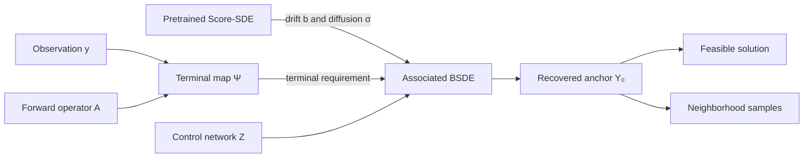

<div align="center">

# Backward SDEs-based Diffusion for Physics-Constrained Generation

### A general framework for addressing inverse problems

**ICML 2026**

[](https://laplacelab.github.io/BSDEDiffusion/)
[](https://laplacelab.github.io/BSDEDiffusion/paper.pdf)
[](SKILL.md)

[](https://www.python.org/)
[](https://pytorch.org/)
[](#verification)

**Zihao Wang**<sup>1</sup><br>
<sup>1</sup>[Laplace Lab](https://laplace.center) · Department of Computer Science, University of Tennessee, Chattanooga, US

Correspondence: `1stname[.]lastname@tennessee.edu`

</div>

<p align="center">
  
</p>

## Overview

Pretrained score-based diffusion models are powerful unconditional priors, but inverse problems require outputs that satisfy a measurement or physics constraint. Common approaches inject guidance, penalties, or projections throughout sampling. This framework instead expresses feasibility where it is required: **at the terminal state**.

Given frozen stochastic prior dynamics and a task-defined terminal map, the framework learns the adapted BSDE pair that connects a prior-space anchor to the required endpoint:

$$
\begin{aligned}
dX_t &= b(t,X_t)\,dt+\sigma(t,X_t)\,dW_t, \\
dY_t &= -f(t,X_t,Y_t,Z_t)\,dt+Z_t\,dW_t, \\
Y_T &= \Psi(X_T;y).
\end{aligned}
$$

The learned value $Y_0$ is an anchored prior state. It can be used for a feasible reconstruction or perturbed locally to study solution uncertainty.

> **Framework, not a CT package.** Sparse-view CT is one evaluation in the paper. The released core has no CT, Radon-transform, image-loading, or dataset dependency. A new application supplies only its prior dynamics, terminal map, and control architecture.

## Why terminal-conditioned inversion?

| Conventional guidance | BSDE Diffusion |
|---|---|
| Modifies the sampling path with task-specific penalties | Keeps the pretrained prior dynamics unchanged |
| Requires a guidance or projection schedule | Places task information in one terminal map |
| May finish outside the feasible set | Encodes endpoint feasibility by construction |
| Often couples solver code to one modality | Exposes a small, modality-agnostic interface |

## Framework at a glance



The reusable core has four extension points:

| Component | Contract | Owned by |
|---|---|---|
| Prior drift | `drift(time, state) -> Tensor` | Application |
| Prior diffusion | `diffusion(time, state) -> Tensor` | Application |
| Terminal map | `terminal(state) -> Tensor` | Application |
| Adapted control | `control(time, state) -> Tensor` | Application |

`AssociatedBSDE` validates the problem definition. `DeepBSDESolver` performs the coupled Euler-Maruyama rollout and minimizes the terminal mismatch. The included `TimeConditionedMLP` is a lightweight reference control for vector-valued problems; structured data can use any compatible PyTorch module.

## Installation

Python 3.10 or newer is required. Install the PyTorch build appropriate for your hardware, then install the framework:

```bash
git clone https://github.com/LaplaceLab/BSDE-Diffusion.git
cd BSDE-Diffusion

python -m venv .venv
source .venv/bin/activate
pip install --upgrade pip
pip install -e .
```

For development and verification:

```bash
pip install -e '.[dev]'
pytest -q
ruff check .
```

## Quick start

The following is a complete terminal-conditioned inverse problem. Replace the simple prior and terminal map with application-specific implementations while preserving the same solver interface.

```python
import torch

from bsde_diffusion import (
    AssociatedBSDE,
    SolverConfig,
    TimeConditionedMLP,
    solve_associated_bsde,
)

device = torch.device("cuda" if torch.cuda.is_available() else "cpu")
dtype = torch.float32

# One shared prior-space anchor. The first dimension is the batch dimension.
initial_state = torch.zeros(1, 16, device=device, dtype=dtype)
observation = torch.ones_like(initial_state)


def prior_drift(time, state):
    """Replace with the drift induced by a frozen Score-SDE prior."""
    return torch.zeros_like(state)


def prior_diffusion(time, state):
    """Diagonal diffusion; scalar or broadcastable outputs are also valid."""
    return torch.full_like(state, 0.2)


def terminal_map(state):
    """Replace with decode -> enforce measurement -> encode."""
    return observation.expand_as(state)


problem = AssociatedBSDE(
    initial_state=initial_state,
    time_grid=torch.linspace(0.0, 1.0, 33, device=device, dtype=dtype),
    drift=prior_drift,
    diffusion=prior_diffusion,
    terminal=terminal_map,
)

control = TimeConditionedMLP(
    event_shape=initial_state.shape[1:],
    hidden_features=128,
    depth=3,
).to(device)

solution = solve_associated_bsde(
    problem,
    control,
    SolverConfig(
        iterations=1_000,
        batch_size=32,
        learning_rate=3e-4,
        gradient_clip=1.0,
    ),
)

print("terminal loss:", solution.final_loss)
recovered_anchor = solution.initial_value
```

## Adapt the framework to your inverse problem

### 1. Connect a frozen prior

Wrap the pretrained stochastic prior as two callables:

```python
prior.eval()
for parameter in prior.parameters():
    parameter.requires_grad_(False)


def drift(time, state):
    return prior.drift(state, time)


def diffusion(time, state):
    return prior.diffusion(state, time)
```

The framework intentionally does not depend on a particular checkpoint format, scheduler, or model library.

### 2. Define feasibility once

When measurement and prior spaces differ, use a decode-enforce-encode composition:

```python
def terminal(state):
    signal = decode(state)
    feasible_signal = enforce_measurement(signal, observation)
    return encode(feasible_signal)
```

`enforce_measurement` may be analytic, iterative, linear, or nonlinear. It must return a deterministic, shape-preserving terminal value for the fixed observation used in that solve.

### 3. Choose the control architecture

The control estimates the martingale integrand $Z_t$ and must return the same shape as the state. Use `TimeConditionedMLP` for vectors and small tensors. For images, volumes, graphs, or time series, supply a compact time-conditioned network appropriate to that structure.

### 4. Verify feasibility in the application domain

Always report both the BSDE terminal mismatch and a domain-level residual such as

$$
\frac{\|\mathcal{A}(\widehat{x})-y\|}{\|y\|}.
$$

A plausible-looking output alone is not evidence that the inverse problem has been solved.

## Public API

| Symbol | Purpose |
|---|---|
| `AssociatedBSDE` | Defines and validates the stochastic prior and terminal-value problem |
| `DeepBSDESolver` | Learns the initial value and adapted control through Monte Carlo rollouts |
| `SolverConfig` | Configures iterations, batch size, learning rate, and gradient clipping |
| `BSDESolution` | Returns the recovered anchor and terminal-loss history |
| `TimeConditionedMLP` | Reference control network for vector-valued states |
| `solve_associated_bsde` | One-call solver construction and optimization |

## Use with a coding agent

This repository includes an [Agent Skill](SKILL.md) that teaches a coding agent how to connect a new prior, implement a terminal map, choose a control network, validate feasibility, and keep application artifacts outside the framework.

Example request:

```text
Use the bsde-inverse-problem skill in this repository to adapt BSDE Diffusion
to my inverse problem. Keep the pretrained prior frozen, place all observation
information in the terminal map, add a domain-level feasibility test, and do
not add datasets, checkpoints, or generated outputs to the framework package.
```

## Verification

The release is checked with CPU-compatible unit tests covering:

- arbitrary tensor event shapes;
- problem and time-grid validation;
- terminal shape preservation;
- Deep-BSDE rollout shape consistency;
- convergence on a deterministic terminal-value problem.

Run the complete release checks with:

```bash
pytest -q
ruff check .
python -m build
```

## Repository scope

This repository intentionally contains only the reusable framework, its tests, package metadata, and documentation. It excludes datasets, model weights, checkpoints, generated samples, experiment outputs, medical data, and modality-specific reconstruction pipelines.

## Citation

If this framework contributes to your research, please cite:

```bibtex
@inproceedings{wang2026backward,
  title     = {Backward SDEs-based Diffusion for Physics-Constrained Generation},
  author    = {Wang, Zihao},
  booktitle = {Proceedings of the 43rd International Conference on Machine Learning},
  series    = {Proceedings of Machine Learning Research},
  volume    = {306},
  publisher = {PMLR},
  year      = {2026}
}
```

## Links

- Project website: <https://laplacelab.github.io/BSDEDiffusion/>
- Paper: <https://laplacelab.github.io/BSDEDiffusion/paper.pdf>
- Lab: <https://laplace.center>
